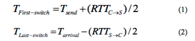

# Latency Monitoring in Software-Defined Networks

### Michal Knapík, Tomáš Krupa

 * [Článok](https://dl.acm.org/citation.cfm?id=3095791&CFID=816129601&CFTOKEN=25017027) ktorý hovorí o danej problematike.

## Analýza a úvod do problému 

V súčastnosti je rýchly nárast aplikácií majúcich striktné požiadavky na [QoS](#QoS). Riadenie týchto aplikácií vyžaduje presné a aktuálne monitorovacie štatistiky sieťových zdrojov. [SDN](#SDN) siete priniesli dôležité zmeny oproti konvenčnýcm IP sieťam. Riadiace a dátové vrstvy sú navzájom oddelené takže sieťové zariadenia už viac nemajú riadiacu funkcionalitu. Riadiaca vrstva je presunutá do externej entity, tzv. [kontroléra](#Kontrolér) a dátová vrstva je použitá na presmerovanie prichádzajúcich dát vychádzajúc z  pred inštalovaného toku v tabuľke tokov. V SDN sieti komunikujú kontrolér z prepínačom cez [OpenFlow](#OpenFlow) protokol. Vďaka možnosti dopytovať sa po štatistike pásma a posielaní kontrólnych paketov do siete je umožnené meranie QoS parametrov v SDN sieti. Existujú viacere spôsoby ako monitorovať QoS parametre, väčšina rieši problematiku využitia pásma, tzv. packet-loss ratio, oneskorenie paketov (per path) a tzv. route tracing. Latencia je meraná v týchto metódach spôsobom end-to-end čo neumožnuje vypočítať latenciu na segmentoch trasy (per link) medzi ľubovoľnými sieťovými zariadeniami, Akékoľvek, meranie per link oneskorenia môže mať značnú dôležitosť ako pre poskytovateľa služieb, tak pre používateľa.

Hlavným prínosom tejto publikácie je nová monitorovacia metóda oneskorenia (per link) v OpenFlow sietiach. Toto riešenie je založené na nasledujúcich krokoch: modifikácia [Dijkstrovho](#Dijkstra) algoritmu hľadania najkratšej cesty v grafe, teda v tomto prípade v sieti, na odvodenie stromu ktorý pokrýva všetky spojenia v sieti s minimálnym počtom skokov (hopov) v každej ceste, kde koreň stromu je monitorovacim bodom (MP). Po odvodení tohto stromu je následne rozdelený do rôznych úrovní počnúc od úrovne 1 až N. Uzly na úrovni 1 sú najbližšie k MP a cesty z MP k týmto uzlom pozostávajú iba z jedného hopu a uzly na úrovni N obsahujú cesty pozostávajúce z N hopov. V tomto bode meriame oneskorenie na ceste pre všetky cesty v strome na každej úrovni. Nakoniec, oneskorenie spojenia a presmerovania môžu byť odvodené vypočítaním rozdielu medzi každými dvoma úrovňami, napr. rozdiel medzi úrovňou 2 a 3 je vo výsledku oneskorenie v spojení medzi týmito dvoma úrovňami.

## Návrh riešenia
V záujme merania oneskorenia spojenia v reálnom čase, prezentovaná metóda založená na OpenFlow protokole používa [POX](#POX) kontrolér. Navrhnutá atchitektúra sa skladá z troch modulov:
 * **Topology discover modul** - využívajúci LLDP protokol na zisťovanie sieťovej topoógie
 * **Tree construction modul** - slúžiaci na odvodenie stromu pokrývajúceho všetky spojenia v sieti a minimalizujúceho celkový počet skokov (hopov) v každej ceste
 * **Path latency monitoring modul** - monitorujúci oneskorenie na ceste, pre všetky cesty v každej úrovni stromu

### Postup:

* Modifikujeme Dijkstrov algoritmus na odvodenie stromu ktorý zahŕňa všetky prepojenia vrámci siete s minimálnym počtom skokov (hopov). Koreň stromu je monitorovací bod (MP). Modifikovaný/implementovaný algoritmus nasadíme pomocou POX kontrolera.
	
	* Topology discover module
	
    	Pomocou [LLDP](#LLDP) protokola získame topológiu siete, následne zo získanej topológie vytvoríme graf ktorý bude reprezentovať všetky prepojenia vrámci všetkých bodov v sieti.
     
	* Tree construction module

		Pomocou už upravaného Dijkstrovho algoritmu odvodíme z grafu strom, ktorý zahŕňa všetky prepojenia v sieti, minimalizuje prepojenia v každej ceste do každého bodu. Redukovaním prepojení a ciest v grafe získame menší overhead v sieti.
        
        
        
* Po odvodení stromu ho rozdelíme na rôzne úrovne (1 až N) podľa počtu skokov (hopov) od koreňa stromu až k danému vrcholu. 
* V tomto bode zmeriame oneskorenie cesty pre všetky cesty v strome na každej úrovni.
	* Path latency monithoring mode
	
    	Pomocou OpenFlow alebo LLDP protokola zmeriame delay vrámci všetkých ciest v grafe. Na každej podceste vrámci grafu použijeme pakety na meranie delay. Vpustíme ho do prvého switchu v každej podceste, pričom každý packet je z posledného switchu poslaný naspäť do kontrolera. Pre vypočítanie času odchodu z prvého switchu a času príchodu do posledného switchu, vypočítame delay z kontroléra do prvého switchu počítaním RTTc→s z kontroléra do switchu, a taktiež vypočítame delay z posledného switchu do kontroléra počítaním RTTs→c. Potom použíjeme obe rovnice na výpočet odchodu a príchodu. Kontroler odhadne celkový delay cesty vypočítaním rozdielu medzi časom odchodu paketu na prvom switchi a časom príchodu na poslednom switchi.
        
         

		Tu Tsend predstavuje čas odosielania sondového paketu z kontrolera a Tarrival predstavujú čas príchodu paketu do kontrolera.
        
* Delay prepojenia a switchu možno vypočítať ako rozdiel medzi každou z dvoch úrovní. Napr., rozdiel medzi 2 a 3 úrovňou spôsobí oneskorenie spojenia medzi týmito dvoma úrovňami.
	* Link delay measurement
	
    	Výstup Tree Construction a Path latency modulov sa používa na rátanie link delay. Obrázok dole reprezentuje prvú cestu v skonštruovanom strome, má tri podcesty (P12. P13, P14). V tejto metóde t1 predstavuje čas odchodu v MP, (t2, t3 a t4) predstavujú časy príchodu sondového paketu na poslednom switchi (P12, P13 a P14). 
        
        

		Na výpočet oneskorenia spojenia medzi switchmi 1 a 5 odčítame t2 a t1 (t2-t1) a vypočítame oneskorenie spojenia medzi switchmi 5 a 6, odčítame t3 a t2 (t3-t2) atď. Po výpočte všetkých oneskorení v sieti môžeme odvodiť ovážený priamy graf topológie siete. Potom tento ovážený graf uložíme do kontrolera na použitie politiky QoS.

## Použité technológie

#### QoS
Quality of Service (Kvalita služby) sú v oblasti sietí s prepájaním paketov mechanizmy na riadenie rezervovania zdrojov, resp. schopnosť poskytovať rôzne priority pre rôzne aplikácie, užívateľov, dátové toky alebo schopnosť garantovať určitú hodnotu výkonu pre dátový tok, napr. garancia požadovanej bitovej rýchlosti, oneskorenie (delay), pravdepodobnosť zahadzovania paketov alebo bitová chybovosť. Garantovanie kvality služby je dôležité v prípade ak sieťová kapacita je nedostačujúca, pretože siete často vyžadujú pevnú prenosovú rýchlosť a sú citlivé na latenciu. 

#### SDN
Software-defined networking (Softvérovo definované siete) je technológia resp. prístup v počítačových sieťach, ktorý umožňuje sieťovým administrátorom programátorsky inicializovať, kontrolovať, meniť a riadiť sieťové správanie v rámci centralizovanej infraštruktúry dynamicky, cez jednotne otvorené rozhrania a prináša abstrakciu (low-level) funkcionalitu, výsledkom čoho je sieť z vysokou spoľahlivosťou, robustnosťou a škálovateľnosťou, zvyčajne prevádzkovaná na klastry, resp. virtuálnom stroji.

#### Kontrolér
Kontrolér možno de facto považovať za vrstvu sieťového middlewaru, ktorá umožňuje abstrakciu od konkrétnych komponentov – switchov, rutrov, load-balancerov alebo firewallov.

#### OpenFlow
OpenFlow je komunikačný protokol používaný medzi kontrolérmi a sieťovými prvkami v SDN sieťach, umožňuje priamo ovplyvňovať spôsob smerovania dát v sieti bezprostredne s prácou presmerovacej vrstvy (forwarding plane).

#### Dijkstrov algoritmus
Dijkstrov algoritmus slúži na hľadanie najkratšej cesty medzi vrcholmi v grafe, ktoré napríklad reprezentujú zapojené zariadenia v sieti. Algoritmus existuje v mnohých variantoch; Dijkstrov pôvodný variant hľadal najkratšiu cestu medzi dvomi uzlami, bežnejšia varianta určí jeden konkrétny uzol za štartovací a nájde najkratšie cesty z neho do všetkých ostatných uzlov v grafe a vytvorí strom najkratšej cesty.

#### POX kontrolér
POX je sieťová softvérová platforma napísaná v programovacom jazyku Python, primárne vyvinutá ako OpenFlow switch, ale vo všeobecnosti použiteľná na implementáciu sieťového softvéru. 

#### LLDP
Link Layer Discovery Protocol je štandardizovaný jednocestný protokol linkovej vrstvy, ktorý výlučne vysiela informácie a nedochádza k žiadnemu potvrdzovaniu prijatia či nadväzovaniu spojenia. Aktívny prvok odosiela (periodicky, alebo po modifikácii) informácie o sebe ostatným LLDP zariadeniam v sieti pomocou multicastu, zariadenia ďalej tieto správy nerozširujú.

